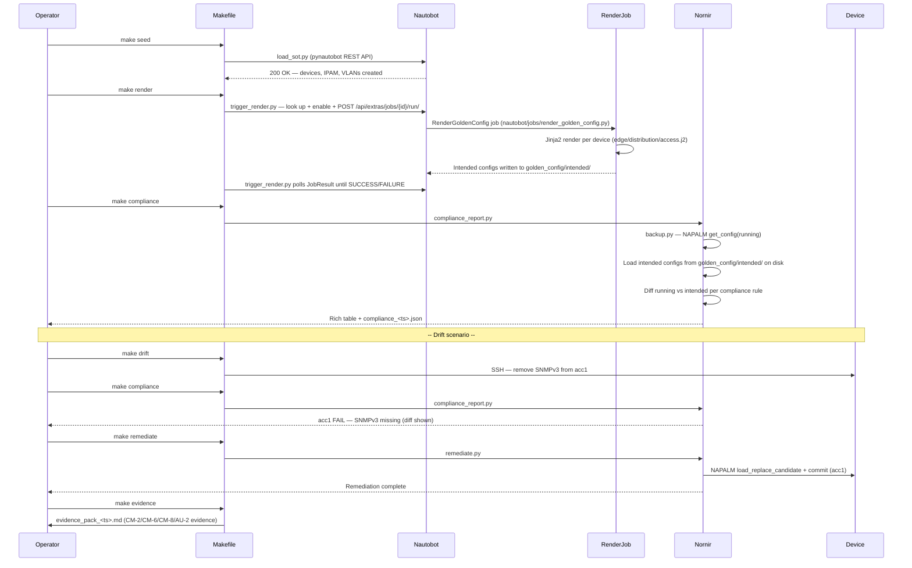

# Architecture

## Topology Diagram

```mermaid
graph TD
    rtr1["rtr1\nedge router\n192.0.2.10\nLo0: 10.255.255.1"]
    dist1["dist1\ndistribution\n192.0.2.11\nLo0: 10.255.255.2"]
    acc1["acc1\naccess\n192.0.2.12\nLo0: 10.255.255.3\nVL 10/20/30"]
    acc2["acc2\naccess\n192.0.2.13\nLo0: 10.255.255.4\nVL 10/20/30"]
    mgmt["mgmt\nlinux\n192.0.2.2\nsyslog + NTP"]
    ztp["ztp\nlinux\n192.0.2.3\nHTTP config server"]

    rtr1 -->|"Et1 10.0.0.0/31"| dist1
    dist1 -->|"Et2 10.0.0.2/31"| acc1
    dist1 -->|"Et3 10.0.0.4/31"| acc2

    mgmt -.->|"OOB mgmt 192.0.2.0/24"| rtr1
    mgmt -.->|"OOB mgmt"| dist1
    mgmt -.->|"OOB mgmt"| acc1
    mgmt -.->|"OOB mgmt"| acc2
    ztp -.->|"HTTP :8000"| rtr1
    ztp -.->|"HTTP :8000"| dist1
    ztp -.->|"HTTP :8000"| acc1
    ztp -.->|"HTTP :8000"| acc2
```



## Compliance Workflow Sequence



## Component Roles

### Nautobot (SoT)

Nautobot acts as the source of truth for all network objects: devices, interfaces, IP addresses, VLANs, and site topology. This stack does not install the `nautobot-golden-config` plugin — `nautobot/jobs/` instead ships plain Nautobot Jobs that get the same auditable, operator-attributed automation without the extra dependency:

- **`RenderGoldenConfig`** — renders Jinja2 templates against live Device ORM objects, writing `golden_config/intended/<location>/<device>.cfg` (triggered by `make render` via `golden_config/trigger_render.py`)
- **`GenerateEvidencePack`** / **`DeployIntendedConfig`** — evidence pack and remediation Jobs; note these two still reference `nautobot_golden_config` models for compliance lookups behind a try/except and currently no-op that piece rather than erroring, since `make evidence` and `make remediate` in this repo's demo flow use the standalone CLI scripts (`evidence/generate_evidence.py`, `nornir/tasks/remediate.py`) instead of invoking these Jobs

### Containerlab + cEOS

Containerlab defines the virtual topology in `clab/hq-tx-01.clab.yml`. Each cEOS container boots with a startup config from `clab/configs/startup/`. After `make lab-up`, the containers are reachable at their management IPs on the `hq-tx-01-mgmt` Docker network.

### Nornir

Three standalone Python scripts handle the active network interaction:

- `backup.py` — pulls running configs via NAPALM (EOS eAPI)
- `compliance_report.py` — diffs running vs. intended using the YAML compliance rules
- `remediate.py` — pushes intended config via NAPALM `load_replace_candidate`

Inventory is pulled dynamically from Nautobot at runtime via `nornir-nautobot`'s `NautobotInventory` plugin.

### Golden Config Templates

Templates follow a role-based hierarchy:

```
golden_config/templates/
├── base.j2                    (common config — imported by role templates)
├── roles/
│   ├── edge.j2                (rtr1)
│   ├── distribution.j2        (dist1)
│   └── access.j2              (acc1, acc2)
└── partials/
    ├── _aaa.j2                (AAA — IA-2)
    ├── _banner.j2             (MOTD banner — AC-8)
    ├── _logging.j2            (syslog — AU-2)
    ├── _ntp.j2                (NTP — AU-8)
    └── _snmp.j2               (SNMPv3 — CM-6)
```

Partials define macros that `base.j2` calls. Role templates import `base.j2` and add role-specific config blocks. This keeps compliance-critical config (AAA, SNMP, logging, banner) in one place and guarantees it appears in every rendered config.
